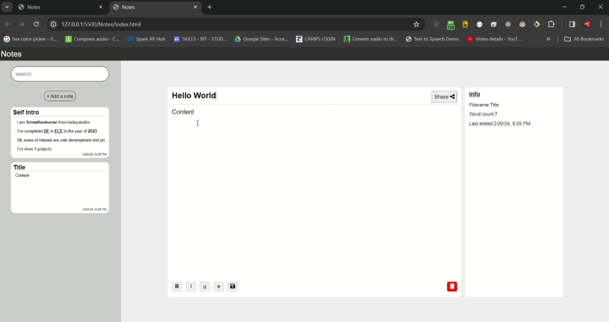

# Notes

### Output

[Click here to watch video](https://youtu.be/VjNP2sL_p9k)

### Front-end
1. HTML
2. CSS
3. JS
   
### Back-end
1. Java
2. PostgreSQL

### Establish Database connection in Java
In NotesRepository.java modify these to make connection

Download the connector jar and add it to the build path
1. [MYSQL](https://dev.mysql.com/downloads/connector/j/)
2. [PostgreSQL](https://jdbc.postgresql.org/download/)

#### MYSQL
```
Class.forName("com.mysql.cj.jdbc.Driver");
String dbURL = "jdbc:mysql://localhost:3306/YOUR_DATABASENAME";
String user = "YOUR_USERNAME";
String pass = "YOUR_PASSWORD";
this.con = DriverManager.getConnection(dbURL, user, pass);
```
#### PostgreSQL
```
Class.forName("org.postgresql.Driver");
String dbURL = "jdbc:postgresql://localhost:5432/YOUR_DATABASENAME";
String user = "YOUR_USERNAME";
String pass = "YOUR_PASSWORD";
this.con = DriverManager.getConnection(dbURL, user, pass);
```
### Create table
#### MYSQL
```
CREATE TABLE IF NOT EXISTS notes_table (
    id INT AUTO_INCREMENT PRIMARY KEY,
    title VARCHAR(255) NOT NULL,
    content TEXT NOT NULL,
    last_edit TIMESTAMP NOT NULL DEFAULT CURRENT_TIMESTAMP
);
```
#### PostgreSQL
```
CREATE TABLE IF NOT EXISTS public.notes_table
(
    id integer NOT NULL DEFAULT nextval('notes_table_id_seq'::regclass),
    title character varying COLLATE pg_catalog."default" NOT NULL,
    content character varying COLLATE pg_catalog."default" NOT NULL,
    last_edit timestamp with time zone NOT NULL DEFAULT CURRENT_TIMESTAMP,
    CONSTRAINT notes_table_pkey PRIMARY KEY (id)
)
```
